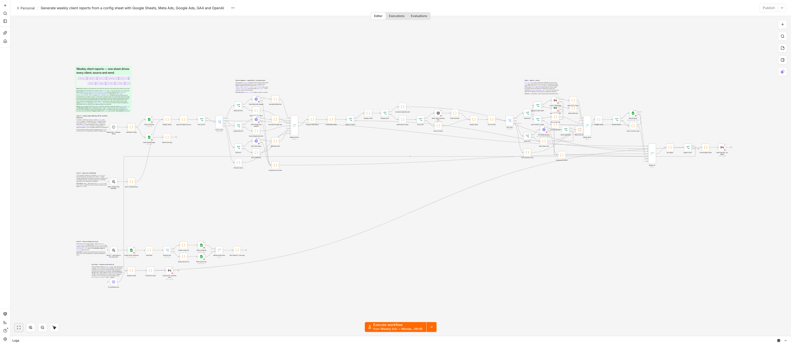

# client-report-generator

Weekly client reports driven by a Google Sheet config — Meta Ads, Google
Ads and GA4 metrics, deterministic week-over-week deltas, AI narrative,
branded HTML delivery by Gmail (send or draft-for-review) and/or Slack,
an idempotent reports ledger, and one operator digest per run.



## Overview

- 87-node n8n workflow, importable `workflow.json` — the demo lane runs
  four clients end-to-end with **zero credentials** (`Test workflow`).
- One row per client in a `config` sheet tab toggles sources, sinks,
  delivery mode (`send`/`draft`), brand header and the anomaly threshold —
  you edit cells, never the workflow.
- The AI only narrates finished numbers: WoW deltas and anomaly flags are
  computed in a Code node, so the prose can never invent math.

## Architecture

```
┌────────┐──▶┌────────┐──▶┌───────┐──▶┌───────────┐──▶┌────────┐──▶┌────────┐
│ config │──▶│ expand │──▶│ fetch │──▶│ normalize │──▶│ deltas │──▶│ dedupe │
└────────┘──▶└────────┘──▶└───────┘──▶└───────────┘──▶└────────┘──▶└───┬────┘
                                                                       │
             ┌────────┐◀──┌────────┐◀──┌───────┐◀──┌────────┐◀──┌──────▼────┐
             │ digest │◀──│ ledger │◀──│ sinks │◀──│ render │◀──│ narrative │
             └────────┘◀──└────────┘◀──└───────┘◀──└────────┘◀──└───────────┘
```

Three layers: the `config` sheet is the control plane; per-source
fetch+normalize adapter pairs sit behind `live?` gates (a named extension
dock attaches new sources/sinks without engine changes); the engine is
config-agnostic — dedupe on `client_id + ISO week`, render, fan out to
sinks, upsert the `reports` ledger, close with an operator digest.

## What it does

Every Monday 09:00 it reads the `config` tab, validates each row, expands
one fetch per enabled source, normalizes to one metric contract, computes
`delta_pct` deterministically and flags metrics past the client's
`alert_threshold_pct`, skips clients already reported this ISO week,
writes the narrative, renders a per-client branded HTML report
(`brand_name`/`brand_color`/`brand_logo_url` cells), delivers through the
enabled sinks (Gmail send **or** draft-for-review via `delivery_mode`,
Slack with `ok`-flag verification), records the send in the `reports`
ledger, and emails the operator a run digest. A source outage alerts
instead of blocking other clients; an unhandled failure lands in the
error lane and is emailed to the operator.

See a real rendered report: [SAMPLE-REPORT.md](SAMPLE-REPORT.md)
(produced by the committed fixture run — anonymized demo clients only).

## Setup

1. **Import** — n8n → Workflows → Import from file → `workflow.json`.
2. **Attach credentials** — Gmail, Google Sheets and OpenAI on the nodes
   that ask; then one generic credential per HTTP node: Header Auth
   (`Authorization: Bearer <token>`) for Meta Ads, GA4 and Slack, and
   Custom Auth for Google Ads (carries both `Authorization` and
   `developer-token`).
3. **Run the setup lane once** — press play on the orange
   `SETUP — press play on this node once` trigger; it creates a
   **Weekly Client Reports** Google Sheet with `config` + `reports`
   tabs and seed rows. Copy the printed `spreadsheet_id`.
4. **Two values** — paste `spreadsheet_id` into **Workflow Config**, and
   your operator address into the **Operator email** node (it receives
   error alerts and the weekly digest).
5. **Fill the `config` tab** — one row per client; `src_*`/`sink_*`
   cells toggle sources and sinks (`yes`/`no`), plus recipient and
   account-id columns. Optional: `delivery_mode` (`draft` = file to
   Gmail drafts for review), `brand_name`/`brand_color`/
   `brand_logo_url`, `alert_threshold_pct`.
6. **Activate** — press **Test workflow** once to watch the four-client
   demo run with zero credentials, then set the workflow **Active**
   (runs Mondays 09:00, workflow timezone). Optional: Settings → Error
   workflow → this workflow.

Full guide with troubleshooting: **[SETUP.md](SETUP.md)**.

## Use cases

- Agencies sending the same weekly performance report to every client.
- Freelancers who want draft-for-review before anything goes to a client.
- Marketing ops that want anomaly flags and an audit ledger, not just a
  pretty email.

## Custom builds

This template is a starting point — extra sources, extra sinks, different
cadence, approval steps, CRM or warehouse writes. If you want it adapted
or a bespoke workflow built for your stack, email **contact@osalk.com**
or visit [osalk.com](https://osalk.com).
